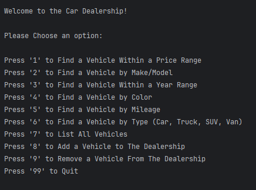
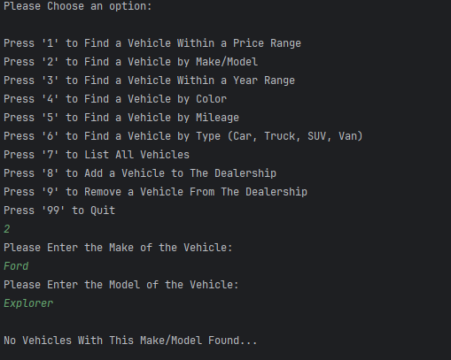
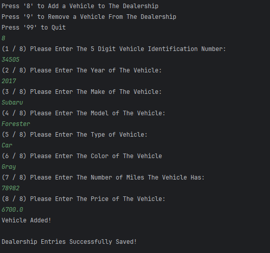
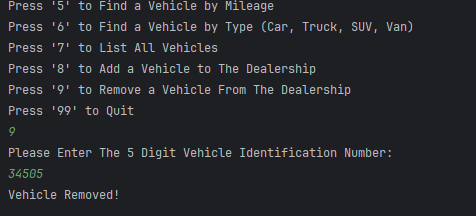
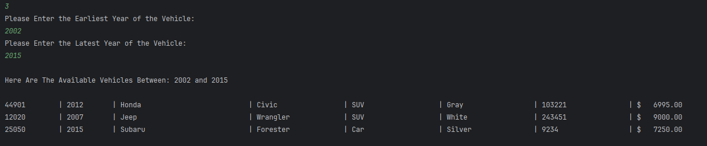

# Object Oriented Car Dealership - Brandon Morse

## The Car Dealership is a store inventory application for vehicles that allows the user to view, add and remove vehicles from their dealership for customers to eventually buy.

## User Stories

- As a customer, I want to search for a vehicle based on an attribute like it's make/model or mileage so that I can buy based on my needs.

- As a user, I want to search see a list of all vehicles so that I can see the info/attributes of all vehicles.

- As a user, I want to add and remove vehicles based on any attribute so that I can keep my dealership up to date with the latest make/models.

- As a user, I don't want to be sent back to the home screen went entering a field incorrectly so that my vehicle addition process is smooth.

## Setup

1. Create the UserInterface, DealershipFileManager, Dealership, Vehicle and Program classes
2. Create the constructor, getters and setters inside the Vehicle class for all vehicle attributes
3. Create the getVehiclesBy methods that write the logic for display filtering
4. Create a buffered reader and buffered writer inside the DealershipFileManager class
5. Create methods inside the UserInterface class that will prompt the user to enter the fields they want to filter by
6. Instantiate the UserInterface class inside the Program class and call the display method that holds the application

### Prerequisites

- IntelliJ IDEA: Ensure you have IntelliJ IDEA installed, which you can download from [here](https://www.jetbrains.com/idea/download/).
- Java SDK: Make sure Java SDK is installed and configured in IntelliJ.

### Running the Application in IntelliJ

Follow these steps to get your Online Store Application running within IntelliJ IDEA:

1. Open IntelliJ IDEA.
2. Select "Open" and navigate to the directory where you cloned or downloaded the project.
3. After the project opens, wait for IntelliJ to index the files and set up the project.
4. Find the main class with the `public static void main(String[] args)` method.
5. Right-click on the file and select 'Run 'YourMainClassName.main()'' to start the application.

## Technologies Used

- IntelliJ (Amazon Corretto 17.0.14)

## Demo

## Future Work

- Customer Vehicle Purchasing Options to be Added in the Future!

## Resources

- [W3 Schools for Documentation ](https://www.w3schools.com/java/ref_string_format.asp)
- [Potato Sensei ] (https://chatgpt.com/g/g-681d378b0c90819197b16e49abe384ec-potato-sensei)

## Team Members

- **Brandon Morse** - Application Development

## Interesting Code

All methods created eventually get called inside the display method in the UserInterface class, meaning display is the only method that gets called inside the Program class.

## Thanks!

- Thank you to Mr. Raymond for continuous support and guidance (Along with Potato Sensei)!
